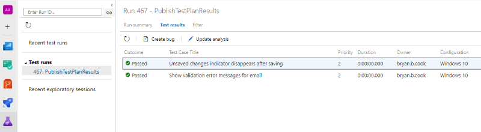
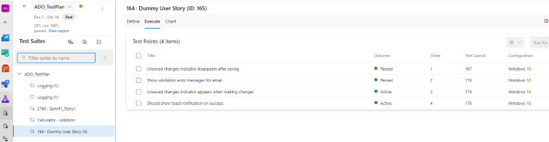
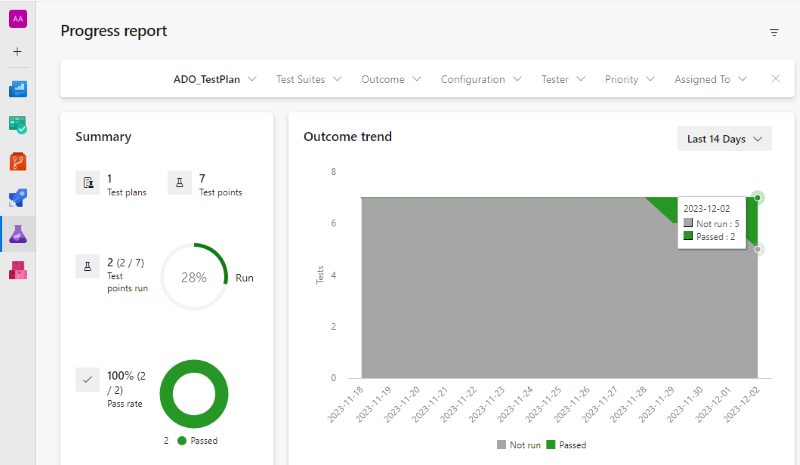

# Publish Test Plan Results

This custom Azure Pipeline task makes it possible to update your Azure DevOps _Test Plan_ using the results of your test automation suite, regardless of which test framework you're using (Cucumber, JUnit, xUnit, others).

```yaml
- task: PublishTestPlanResults@1
  inputs:
    testPlan: 'Test Plan 01'
    testResultFormat: xUnit
    testResultFiles: $(Build.StagingDirectory)/testResults.xml
```

## Track Progress

Results from your Test Automation are available in **Test Plans / Runs**:



Progress is reflected in your Test Cases:



And overall progress is reflected in the Test Plan report:



## A quick primer on Azure Test Plans

It's helpful to understand the following about Azure _Test Plans_:

- You can have one or more _Test Plans_ for a given Azure DevOps Project. Some teams have only a single _Test Plan_, others create a _Test Plan_ per sprint, and some may create ad-hoc or fit for purpose plans.
- Each _Test Plan_ has a name and optional start and end date.
- Each _Test Plan_ has at least one _Test Configuration_ that represents a platform or environment. For example, "Internet Explorer on Windows 11".
- _Test Plans_ are comprised of one or more _Test Suites_.
- _Test Suites_ are comprised of one or more _Test Cases_.
- Each _Test Case_ is associated with at least one or more _Test Configuration_.

The combination of _Test Case_ + _Test Configuration_ is referred to as a **_Test Point_**.

When we publish our test results from our test framework to the _Test Plan_, we are interested in creating a _Test Run_ that contains an outcome for each _Test Point_. There is a one-to-one mapping between each individual automated test and a _Test Point_.

## Mapping Test Results to Test Cases

The `PublishTestPlanResults` task supports several different mapping strategies to help you link your test framework results to Test Cases (_Test Points_). The default `auto` strategy will attempt to find the appropriate strategy for you, or you can customize the configuration to meet your needs.

### Test Case Mapping Strategies

The following strategies are used to match the test automation result to individual _Test Point_ items:

- `TestName`: the name of the automated test must match the title of the _Test Case_.

  Hyphens, spaces and underscores are removed from both the automated test name and the _Test Case_ title to simplify case-insensitive comparisons.

  > **Note**:
  >
  > This approach might be the easiest to configure, but is prone to mismatch errors if either the name of the _Test Case_ or test method change.
  > We recommend using the `RegEx` or `TestProperty` strategies to avoid mismatch issues.

- `RegEx`: the `id` of the _Test Case_ appears in the name of the test automation name.

   The regex to find the test case identifier can be customized by setting the `testCaseRegex`.

   Most test frameworks should allow you to specify the _Test Case_ identifier somewhere in the name of the test automation.

   ```csharp
   // xunit
   [Fact]
   public void TestCase1234_ShouldAddTwoNumbers()
   {
   }

   // junit
   @Test
   public void TestCase1234_shouldAddTwoNumbers() {
   }

   // cucumber
   Scenario: TestCase1234 Can add two numbers

   // javascript
   it('Should add two numbers TestCase1234', () => {
   });

   // pester
   it 'Should add two numbers TestCase1234' {
   }
   ```

- `TestProperty`: the `id` of the _Test Case_ appears in the meta-data for the test.

   The meta-data element to use defaults to `TestCase`, but this can be customized by setting the `testCaseProperty` setting.

   Each test framework supports mechanisms to attach property meta-data in the output, some examples:

   ```csharp
   // xunit
   [Fact]
   [Trait("TestCase", "1234")]
   public void ShouldAddTwoNumbers() 
   {
   }

   // nunit
   [Test]
   [Property("TestCase","1234")]
   public void ShouldAddTwoNumbers()
   {
   }

   // cucumber
   @TestCase=1234
   Scenario: Add Two Numbers

   // javascript
   it('Add Two Numbers @TestCase=1234', () => {})
   it('Add Two Numbers #TestCase=1234', () => {})
   ```
- `VsProperty`: matches the automated test result using the [_Associate to a Test Case_](https://learn.microsoft.com/en-us/azure/devops/test/associate-automated-test-with-test-case?view=azure-devops) feature of Visual Studio. This matching strategy is [limited to specific frameworks](https://learn.microsoft.com/en-us/azure/devops/test/associate-automated-test-with-test-case?view=azure-devops#test-types).

### Test Config Mapping Strategies

If your Test Plan supports multiple _Test Configurations_, you'll need a mechanism to map the test results to the appropriate _Test Configuration_.

If you've specified a `testConfigFilter` then only _TestPoints_ for that _Test Configuration_ will be updated. However, if your test-automation contains the outputs from multiple configurations, additional configuration settings are needed:

- `Config Aliases`: the `testConfigAliases` setting is used to configure one or more simple name aliases for the _Test Configuration_ in your _Test Plan_. For example, "x86_chrome" can be used in the tests instead of "Chrome on Windows 11".

- `ConfigProperty`: the configuration name or alias is defined in the meta-data for the test automation result. The `testConfigProperty` setting is used to define one or more test-meta properties to inspect.

## Examples

### Basic Usage (xUnit)

In this example, we're using a [trait][xunit-traits] named _TestId_ to hold the id of the TestCase in our TestPlan.

```csharp
[Fact]
[Trait("TestId","12345")] // 12345 is a TestCase identifier in our TestPlan
public void AddItemToShoppingCart() {
  // ... test automation
}
```

In our Azure Pipeline, after running your tests, you can update your Azure Test Plan _Test Plan 01_ using the following syntax:

```yaml
- task: PublishTestPlanResults@1
  inputs:
    testPlan: 'Test Plan 01'
    testResultFormat: xUnit
    testResultFiles: $(Build.StagingDirectory)/testResults.xml
    testCaseMatchingStrategy: property
    testCaseProperty: TestId
```

[xunit-traits]: https://www.brendanconnolly.net/organizing-tests-with-xunit-traits/
