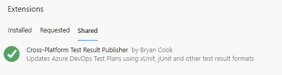

# Installation (Private Preview)

Thank you for your interest in my Test Plan extension! Well, why the private preview? The best answer to that is that I'm fairly risk-adverse and would like to have the extension as stable as possible with samples before letting the public at it. I take pride in building awesome things.

The other reason for the private preview is I'd like to understand how you're using the extension, what's working and what challenges you might be experiencing, as well as features that you'd like to see.

## Getting Access

To install this extension during the private preview, [submit a request][new-request] and provide the name of your Azure DevOps Organization in the request. The Organization Name is manadatory and I cannot share it without it.

[new-request]: https://github.com/bryanbcook/azuredevops-testplan-extension/issues/new

## Install the Extension

Once your Azure DevOps Organization is listed in the trusted organizations, your Project Collection Administrator can install it through the link available in the **General > Extensions : Shared** tab.

## Contributing

How can you help?

- Star the Repo (I like stars!)
- Submit a feature request
- Pull Requests are welcome. Sample projects that demonstrate how you've configured your tests and pipeline are greatly needed.

See the [Contributing doc](../CONTRIBUTING.md) for how to develop and test the extension locally.
